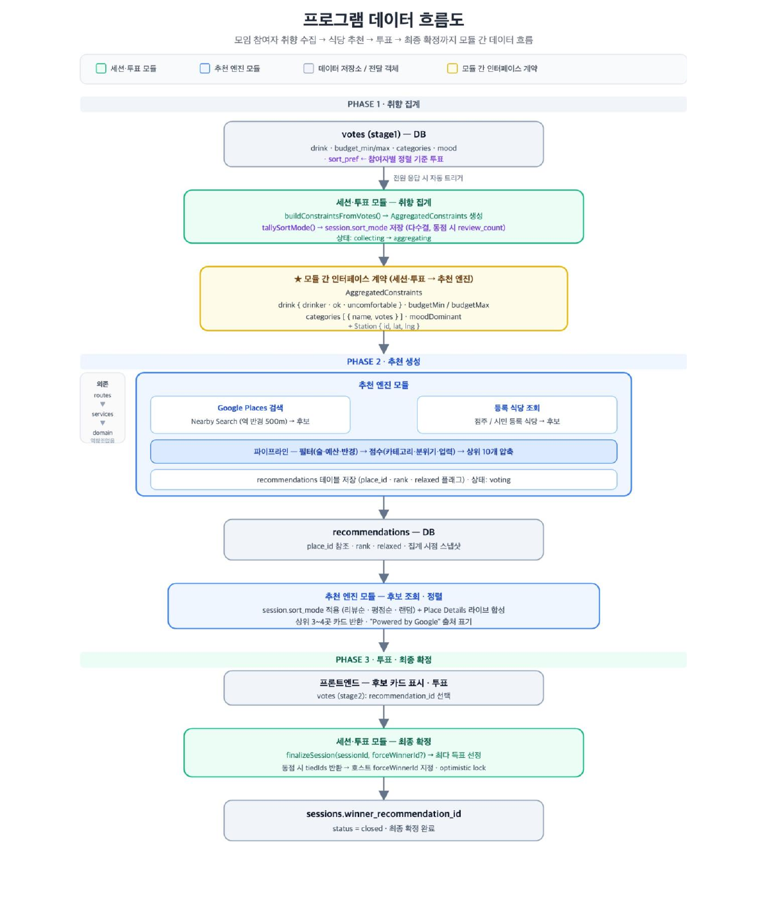
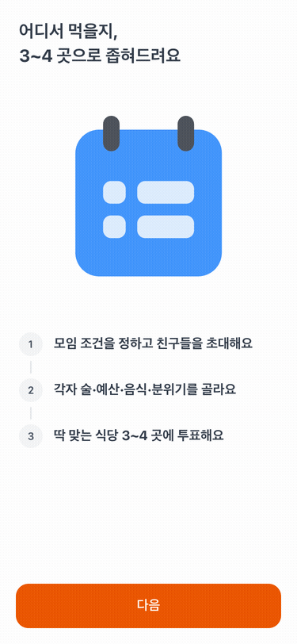
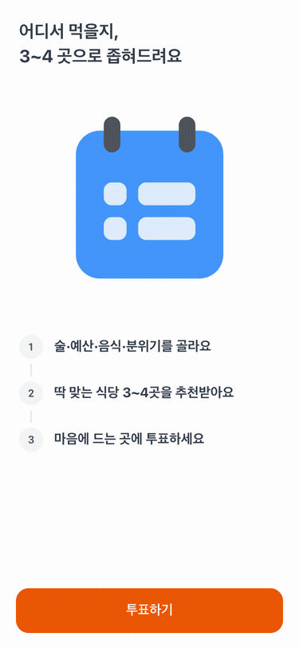
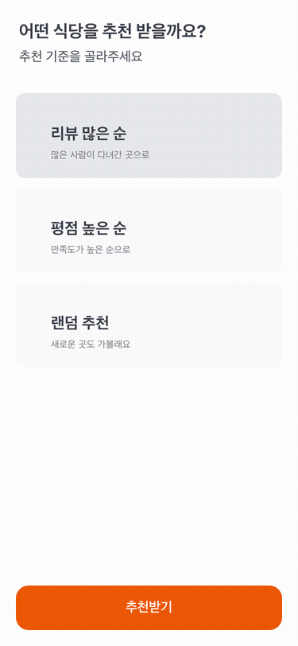

[](https://react.dev/)
[](https://vitejs.dev/)
[](https://tanstack.com/query)
[](https://apps-in-toss.toss.im/)
[](https://www.typescriptlang.org/)

<div align="center">
  
</div>

<div align="center"><h1>🍽️ <span style="color:#FF5F00;">냠냠투게더</span> — 프론트엔드 (Apps in Toss 미니앱)</h1></div>

**"확정기가 아니라 압축기."** 모임 참여자들의 취향(술·예산·음식·분위기·정렬)을 모아 **역 근처 식당 3~4곳으로 압축**해 투표·확정하게 하는 앱인토스(Apps in Toss) 미니앱의 프론트엔드입니다. 토스 WebView에서 동작하며, 화면 라우팅·폴링·상태 게이팅을 한곳(`ScreenRouter`)에서 관리합니다.

<br>

## 목차
- [프로젝트 소개](#프로젝트-소개)
  - [💡 프로젝트를 왜 시작하게 되었나요?](#-프로젝트를-왜-시작하게-되었나요)
  - [🔑 프로젝트의 핵심은 무엇인가요?](#-프로젝트의-핵심은-무엇인가요)
  - [🎁 기대 효과는 무엇인가요?](#-기대-효과는-무엇인가요)
- [팀 소개](#팀-소개)
- [개발 기간](#개발-기간)
- [기술 스택](#기술-스택)
- [데이터 흐름](#데이터-흐름)
- [핵심 기능 소개](#핵심-기능-소개)
  - [🎬 모임 생성 & 초대](#-모임-생성--초대)
  - [🥢 취향 입력](#-취향-입력)
  - [🗳️ 추천 · 투표 · 확정](#️-추천--투표--확정)
- [프로젝트 구조](#프로젝트-구조)
- [실행 · 배포](#실행--배포)

---

<br>

## 프로젝트 소개

냠냠투게더는 여럿이 모일 때 **"아무거나 다 좋아~"** 로 30분씩 늘어지던 식당 정하기를, 링크 하나로 모두의 취향을 모아 **몇 분 만에** 끝내주는 그룹 의사결정 도구입니다.

### 💡 프로젝트를 왜 시작하게 되었나요?

모임에서 식당을 정하는 일은 늘 피곤합니다. 단톡방에 "여기 어때?"를 수십 번 던져도 결론은 잘 나지 않고, 결국 한 사람이 총대를 메거나 아무 데나 가게 됩니다. 술을 안 마시는 사람, 예산이 빠듯한 사람, 특정 음식을 못 먹는 사람 — 각자의 조건은 다른데 이걸 한 번에 모을 방법이 없었습니다.

그래서 **취향을 링크 하나로 모아 자동으로 후보를 좁혀주고, 최종 선택만 투표로 맡기는** 서비스를 기획했습니다. 서비스는 답을 정해주지 않습니다. 갈 만한 곳만 3~4곳으로 **압축**해줄 뿐, 결정은 사람이 합니다.

### 🔑 프로젝트의 핵심은 무엇인가요?

- **토스 네이티브 UX** — TDS Mobile 컴포넌트로 토스 앱과 이질감 없는 바텀시트·리스트·CTA를 구현했습니다.
- **한곳에서 관리하는 상태 머신** — 화면 전환·폴링·게이팅 결정을 `ScreenRouter` 한 곳에 모아, 대기 화면에서 집계 완료를 폴링해 자동 전환합니다.
- **호스트도 참여자** — 호스트 역시 취향(1차)·식당(2차) 투표를 동일하게 하며, 링크를 받은 참여자는 무로그인(익명)으로 바로 참여합니다.

### 🎁 기대 효과는 무엇인가요?

- **빠른 의사결정** — 링크 공유와 투표로 식당 선정을 몇 분 만에.
- **낮은 진입 장벽** — 참여자는 앱 설치·로그인 없이 토스 링크 하나로 참여.
- **일관된 경험** — 백엔드가 결정한 정렬(다수결)을 그대로 표시해 모든 참가자가 같은 순서를 봅니다.

<br>

## 팀 소개

> 🎉 **제로 데이(Zero Day)**

| 이름 | 역할 | 주요 담당 |
| :---: | :---: | :--- |
| **한성민** ([@kkx7787](https://github.com/kkx7787)) | PM · 백엔드 | 프로그램 총괄 · 문서화 · 프론트/백 API 연동 |
| **고윤** ([@K-yoon03](https://github.com/K-yoon03)) | 백엔드 | DB 스키마·RLS · 세션/투표/집계 API · 인증 미들웨어 |
| **양은영** ([@yangtori0407](https://github.com/yangtori0407)) | 백엔드 | 추천 엔진 · Google Places(New) 연동 · 도메인 로직 |
| **윤여훈** ([@Hoon-KR](https://github.com/Hoon-KR)) | UI · 프론트엔드 | 화면설계 · 프론트 화면/기능 구현 · 단위·통합 테스트 |
| **차윤희** ([@chayh414](https://github.com/chayh414)) | UI · 프론트엔드 | 화면설계(Figma) · 프론트 화면/기능 구현 · 테스트 · 문서화 |

<br>

## 개발 기간

- **전체 기간**: 2026년 6월 19일(금) ~ 2026년 6월 26일(금)
- **발표**: 2026년 6월 26일(금) 15:30 — 제로 데이
- **배포**: 앱인토스 콘솔 등록 · 출시 완료

<br>

## 기술 스택

| 분류 | 스택 |
| --- | --- |
| **Language** |  |
| **Framework** |   |
| **Build** |   |
| **UI** |  |
| **State / Data** |  |
| **Test** |    |

> 백엔드: Supabase Edge Function `api` — [NyamNyam-Together](https://github.com/polytech-zero-day/NyamNyam-Together)

<br>

## 데이터 흐름

취향 수집(stage1) → 집계 → 추천 생성 → 후보 투표(stage2) → 최종 확정까지, 모듈 간 데이터가 어떻게 흐르는지 정리한 다이어그램입니다.

<div align="center"></div>

- **집계 게이팅**: 취향을 제출한 사용자는 대기 화면에 머물며, **집계 완료(status=voting)** 를 폴링해 준비되면 자동 전환합니다.
- **정렬**: 정렬 기준은 참여자 다수결로 백엔드에서 결정되며, 프론트는 그 순서를 그대로 표시합니다.

<br>

## 핵심 기능 소개

### 🎬 모임 생성 & 초대
- **호스트가 조건을 정하고 친구들을 초대**
  - 토스 로그인 → 모임 목적·최대 인원·위치(역)·마감 시간 입력
  - 그룹 고유 초대 링크 발급 → 복사·단톡방 공유

<div align="center"></div>

<br>

### 🥢 취향 입력
- **각자 술·예산·음식·분위기를 골라요**
  - 술자리 수용도, 예산 구간, 음식 카테고리(최대 3개), 분위기 선택
  - 마지막으로 추천 정렬 기준(리뷰순·평점순·랜덤)을 투표

<div align="center"></div>

<br>

### 🗳️ 추천 · 투표 · 확정
- **압축된 3~4곳에 투표하고 결과를 확인해요**
  - 취향으로 좁혀진 후보를 세션 정렬 순서로 표시(평점·리뷰수, "Powered by Google")
  - 마음에 드는 곳에 투표 → 전원 완료 시 집계 → 최종 장소 확정·공유

<div align="center"></div>

<br>

## 프로젝트 구조

```
src/
├─ App.tsx           # ScreenRouter — 화면 라우팅·폴링·게이팅 단일 관리
├─ store.tsx         # 전역 상태(screen · role · meeting · participant)
├─ screens/          # 21개 화면 + 9개 바텀시트(인트로·로그인·모임생성·취향·정렬·투표·결과)
├─ api/              # client · auth · dto · adapters · endpoints · queries(TanStack) · tokenStore
├─ lib/              # appActions(토스 브리지) · toast(중앙 경고 모달) · browser-shim
└─ test/msw/         # MSW 핸들러·픽스처(목 모드·테스트 공용)
```

<br>

## 실행 · 배포

```bash
npm install
npm run dev          # granite dev (로컬, http://localhost:5173)
npm test             # vitest — 화면·어댑터 단위 테스트
npm run storybook    # 스토리북

npm run build        # ait build → dist/ + .ait
npm run deploy       # ait deploy (앱인토스 콘솔 버전 등록)
```

<br>

---

<div align="center"><sub>냠냠투게더 · 제로 데이 · Powered by Google</sub></div>
